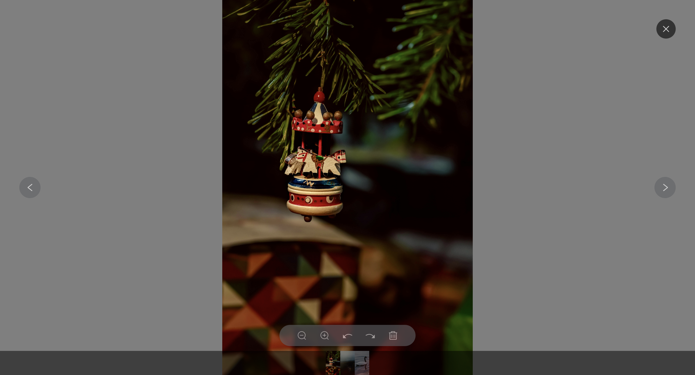

此包为iv-viewer-v2的复制版本，旨在修复一些使用过程中遇到的问题
- 修复当文件后缀为大写时（例如.JPG）提示“无效URL”的问题

# iv-viewer-v2
 简易的Vue 2 组件，用于无缝预览图片和视频，可浏览、缩放、旋转和删除。



## 安装

您可以通过 npm 或 yarn 安装 iv-viewer-v2：

```bash
# 使用 npm
npm install @shengtaojin/iv-viewer-v2 --save

# 使用 yarn
yarn add @shengtaojin/iv-viewer-v2
```

## 使用方法

首先，在您的 Vue 项目中全局或局部注册该组件。

### 全局注册

```javascript
// main.js
import Vue from 'vue'
import IVViewer from '@shengtaojin/iv-viewer-v2'

Vue.component('iv-viewer', IVViewer)

new Vue({
  render: h => h(App),
}).$mount('#app')
```

### 局部注册

```vue
<!-- YourComponent.vue -->
<template>
  <div>
    <button @click="showViewer = true">打开查看器</button>
    <iv-viewer
      :urlList="mediaList"
      :visible.sync="showViewer"
      :currentIndex="0"
      @close="handleClose"
      @delete="handleDelete"
    ></iv-viewer>
  </div>
</template>

<script>
import IVViewer from '@shengtaojin/iv-viewer-v2'

export default {
  components: {
    IVViewer
  },
  data() {
    return {
      showViewer: false,
      mediaList: [
        'https://example.com/image1.jpg',
        'https://example.com/video1.mp4',
        'https://example.com/image2.png',
        // 添加更多媒体 URL
      ]
    }
  },
  methods: {
    handleClose() {
      this.showViewer = false
    },
    handleDelete({ index, url, fileList }) {
      // 处理删除逻辑
      console.log(`已删除索引 ${index} 的媒体: ${url}`)
      this.mediaList = fileList
    }
  }
}
</script>
```

## 属性

| 属性名称       | 类型      | 默认值                   | 描述                                                            |
| -------------- | --------- | ------------------------ | --------------------------------------------------------------- |
| `urlList`      | `Array`   | `[]`                     | 要显示的媒体 URL 数组。支持图片和视频 URL。                     |
| `currentIndex` | `Number`  | `0`                      | 查看器打开时初始显示的媒体索引。                                |
| `imageTypes`   | `Array`   | `['jpg', 'png', 'jpeg']` | 自定义查看器识别的图片文件扩展名列表。                          |
| `videoTypes`   | `Array`   | `['mp4']`                | 自定义查看器识别的视频文件扩展名列表。                          |
| `visible`      | `Boolean` | `false`                  | 控制查看器的可见性。可与 `.sync` 修饰符一起使用，实现双向绑定。 |
| `readonly`     | `Boolean` | `false`                  | 设置为 `true` 时，禁用删除                                      |

## 事件

| 事件名称 | 负载                                              | 描述                                                                    |
| -------- | ------------------------------------------------- | ----------------------------------------------------------------------- |
| `close`  | `() => void`                                      | 当查看器关闭时触发。                                                    |
| `open`   | `() => void`                                      | 当查看器打开时触发。                                                    |
| `delete` | `{ index: Number, url: String, fileList: Array }` | index:当前删除索引，url：当前删除的文件路径，fileList：删除后的文件列表 |

## 示例

```vue
<template>
  <div id="app">
    <h1>iv-viewer 示例</h1>
    <button @click="openViewer">打开媒体查看器</button>
    <iv-viewer
      :urlList="mediaFiles"
      :visible.sync="isViewerVisible"
      :currentIndex="0"
      @close="onViewerClose"
      @open="onViewerOpen"
      @delete="onMediaDelete"
    ></iv-viewer>
  </div>
</template>

<script>
import IVViewer from 'iv-viewer-v2'

export default {
  name: 'App',
  components: {
    IVViewer
  },
  data() {
    return {
      isViewerVisible: false,
      mediaFiles: [
        'https://example.com/image1.jpg',
        'https://example.com/video1.mp4',
        'https://example.com/image2.png',
      ]
    }
  },
  methods: {
    openViewer() {
      this.isViewerVisible = true
    },
    onViewerClose() {
      this.isViewerVisible = false
    },
    onViewerOpen(){},
    onMediaDelete({ index, url, fileList }) {
      this.mediaFiles = fileList
      console.log(`已删除媒体: ${url}，索引: ${index}`)
    }
  }
}
</script>

<style>
#app {
  font-family: Avenir, Helvetica, Arial, sans-serif;
  text-align: center;
  margin-top: 60px;
}
</style>
```

## 许可证

[MIT](https://opensource.org/licenses/MIT)
